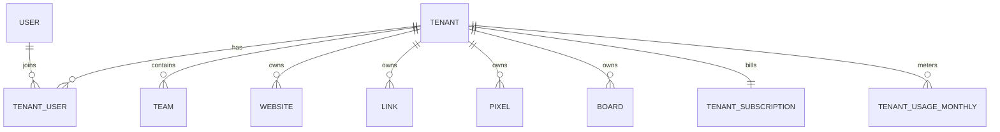

# SaaS Multitenancy Foundation

## Decision

Umami open source has multi-user and team collaboration primitives, but it is not a complete SaaS multitenant product boundary. This fork introduces a first-class `Tenant` layer and keeps existing `User` and `Team` behavior compatible while new SaaS capabilities are added.

The tenant layer is the authority for:

- customer/account boundary
- plan, subscription, and billing status
- usage aggregation and quota enforcement
- members and tenant-scoped roles
- future white-label, domain, SSO, audit log, and agency/client controls

`Team` remains a collaboration unit. It should not be the long-term billing or customer boundary.

## Inputs

The product research document at `/Users/watson/codingProj/umami_proj/docs/基于 umami 的 ai 分析工具的调研报告_kimi.docx` defines the SaaS target as:

- Free -> Starter -> Pro -> Team -> Enterprise pricing
- event-volume billing with website, retention, AI add-on, and team/agency constraints
- Month 2 delivery of core SaaS functions, specifically multitenancy and billing
- agency/customer-project scenarios that require white-label, tenant isolation, and automated reporting
- later enterprise needs including SSO/SAML, audit logs, SLA, and customer success workflows

Umami open source provides useful primitives:

- users and global admin
- teams with owner/manager/member/view-only roles
- resources owned by `userId` or `teamId`
- `CLOUD_MODE` branches that expect external account/team subscription metadata in Redis

Those primitives are not enough for the product plan because a global admin can access all data, there is no tenant lifecycle, no open-source billing ledger, no tenant-scoped quota source of truth, and no durable organization boundary above teams.

## Current Implementation

This branch adds:

- `Tenant`
- `TenantUser`
- `TenantSubscription`
- `TenantUsageMonthly`
- optional `tenantId` columns on `User`, `Website`, `Team`, `Link`, `Pixel`, and `Board`
- tenant roles:
  - `tenant-owner`
  - `tenant-admin`
  - `tenant-billing`
  - `tenant-member`
  - `tenant-viewer`
- tenant plan and status constants
- tenant permissions and API routes:
  - `GET /api/tenants`
  - `POST /api/tenants`
  - `GET /api/tenants/:tenantId`
  - `POST /api/tenants/:tenantId`
  - `DELETE /api/tenants/:tenantId`

The migration backfills:

- one personal tenant per existing user
- one team tenant per existing team
- tenant membership from existing users and team members
- resource `tenantId` from existing `userId` or `teamId`
- a default free subscription for every tenant
- a current-month usage row with website/member counts

## Compatibility Rules

For now, existing `userId` and `teamId` access checks remain in place. `tenantId` is additive.

This avoids a risky rewrite of analytics queries and UI flows while giving new SaaS features a stable root object. The next migrations should move read/write paths gradually from:

```text
User/Team -> Website/Link/Pixel/Board
```

to:

```text
Tenant -> Team/User membership -> Website/Link/Pixel/Board
```

## Target Model



## Plan Mapping

Recommended product limits from the research document map to tenant plans:

| Plan | Events/month | Websites | Retention | Intended customer |
| --- | ---: | ---: | --- | --- |
| Free | 50K | 1 | 3 months | personal MVP validation |
| Starter | 100K | 3 | 1 year | blogs and small projects |
| Pro | 500K | 10 | 2 years | SaaS and startups |
| Team | 2M | unlimited | 3 years | multi-product teams and agencies |
| Enterprise | custom | custom | custom | SSO, SLA, compliance |

Plan enforcement should read from `TenantSubscription` and `TenantUsageMonthly`, not from Redis-only Cloud account records. Redis can remain a cache.

## Next Steps

1. Add tenant-aware quota helpers for websites, events, members, retention, AI queries, and add-ons.
2. Update website creation to require or infer `tenantId`, while retaining compatibility with personal user ownership.
3. Add tenant switcher UI and tenant settings pages.
4. Add member invitation and role management under `/api/tenants/:tenantId/users`.
5. Move Cloud/Stripe billing integration into `TenantSubscription`.
6. Add usage aggregation jobs that populate `TenantUsageMonthly.eventCount`.
7. Add white-label settings as `TenantBranding` or a structured `Tenant.metadata` contract.
8. Add audit logs before enterprise roles/SSO.

## Rejected Alternatives

- Use `Team` as the tenant boundary. Rejected because teams are collaboration groups and already carry product semantics that do not cover personal accounts, billing ownership, agency client isolation, or enterprise organization controls.
- Keep `CLOUD_MODE` Redis account objects as the source of truth. Rejected because Redis is a cache/integration surface, not durable billing or tenant state.
- Rewrite all analytics access checks in one pass. Rejected because the blast radius touches most API routes and query modules; additive `tenantId` plus staged migration is safer.
