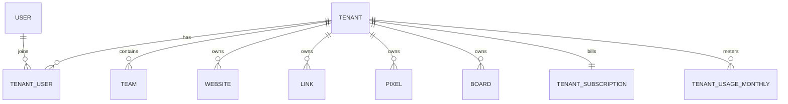

# SaaS Multitenancy Foundation

## Decision

Umami open source has multi-user and team collaboration primitives, but it is not a complete SaaS multitenant product boundary. This fork introduces a first-class `Tenant` layer and keeps existing `User` and `Team` behavior compatible while new SaaS capabilities are added.

The tenant layer is the authority for:

- customer/account boundary
- plan, subscription, and billing status
- usage aggregation and quota enforcement
- members and tenant-scoped roles
- future white-label, domain, SSO, audit log, and agency/client controls

`Team` remains a collaboration unit. It should not be the long-term billing or customer boundary.

## Inputs

The product research document at `/Users/watson/codingProj/umami_proj/docs/基于 umami 的 ai 分析工具的调研报告_kimi.docx` defines the SaaS target as:

- Free -> Starter -> Pro -> Team -> Enterprise pricing
- event-volume billing with website, retention, AI add-on, and team/agency constraints
- Month 2 delivery of core SaaS functions, specifically multitenancy and billing
- agency/customer-project scenarios that require white-label, tenant isolation, and automated reporting
- later enterprise needs including SSO/SAML, audit logs, SLA, and customer success workflows

Umami open source provides useful primitives:

- users and global admin
- teams with owner/manager/member/view-only roles
- resources owned by `userId` or `teamId`
- `CLOUD_MODE` branches that expect external account/team subscription metadata in Redis

Those primitives are not enough for the product plan because a global admin can access all data, there is no tenant lifecycle, no open-source billing ledger, no tenant-scoped quota source of truth, and no durable organization boundary above teams.

## Umami Cloud Settings Audit

The logged-in Umami Cloud settings UI exposes a useful product reference for a hosted SaaS edition. The settings information architecture is:

- Account
  - Preferences
  - Account
  - Notifications
- Data Access
  - Data
  - API keys
- Features
  - Email reports
  - IP filters
  - White-label
- Administration
  - Teams
  - Billing
  - Usage
- Help
  - Support

Observed settings surfaces:

| Surface | Visible controls/capability | Product implication |
| --- | --- | --- |
| Preferences | default date range, timezone, language, theme/version | user-level preferences, not tenant-level |
| Account | account id, name, email, data region, password/email changes, account deletion | identity profile and data-region metadata are separate from tenant billing |
| Notifications | product/update email preference | notification preferences need per-user and later per-tenant channels |
| Data | export all data; import data gated behind upgrade | tenant data export/import should be plan-gated and asynchronous |
| API keys | requires Pro plan | API access is a paid feature and should be tenant-scoped |
| Email reports | requires Pro plan | scheduled reports are a paid feature; likely tenant/team scoped |
| IP filters | requires Pro plan | traffic exclusion settings are tenant/website scoped and paid |
| White-label | requires Business plan; own company name, logo, domain | branding and custom domain are tenant-level Business+ capabilities |
| Teams | join team | teams are administration/collaboration, not the billing root |
| Billing | plan cards and upgrade/contact actions | subscription plan is the central gate for features and limits |
| Usage | usage page | metering needs a tenant-level source of truth even when empty |
| Support | support email, Discord, docs | support entitlement can be plan-dependent |

Observed Umami Cloud plan ladder:

| Plan | Price | Events included | Overage | Websites | Members | Retention | Notable features |
| --- | ---: | ---: | ---: | ---: | ---: | --- | --- |
| Hobby | $0/mo | 100K/month | none visible | 1 | not visible | 6 months | community support |
| Pro | $20/mo | 1M/month | $0.00003/event | 20 | 10 | 2 years | API access, email support |
| Business | $200/mo | 10M/month | $0.00002/event | unlimited | unlimited | 5 years | session recording, white-labeling, streaming API, chat support |
| Enterprise | custom | custom | custom | custom | custom | custom | SAML SSO, onboarding, uptime SLA, invoice billing, enterprise support |

This confirms that our SaaS multitenancy design should treat features as tenant plan entitlements rather than user preferences. User settings remain personal, while data access, feature gates, teams, billing, usage, white-label, support entitlement, and enterprise controls belong under the tenant/account boundary.

## Current Implementation

This branch adds:

- `Tenant`
- `TenantUser`
- `TenantSubscription`
- `TenantUsageMonthly`
- optional `tenantId` columns on `User`, `Website`, `Team`, `Link`, `Pixel`, and `Board`
- tenant roles:
  - `tenant-owner`
  - `tenant-admin`
  - `tenant-billing`
  - `tenant-member`
  - `tenant-viewer`
- tenant plan and status constants
- tenant permissions and API routes:
  - `GET /api/tenants`
  - `POST /api/tenants`
  - `GET /api/tenants/:tenantId`
  - `POST /api/tenants/:tenantId`
  - `DELETE /api/tenants/:tenantId`

The migration backfills:

- one personal tenant per existing user
- one team tenant per existing team
- tenant membership from existing users and team members
- resource `tenantId` from existing `userId` or `teamId`
- a default free subscription for every tenant
- a current-month usage row with website/member counts

## Compatibility Rules

For now, existing `userId` and `teamId` access checks remain in place. `tenantId` is additive.

This avoids a risky rewrite of analytics queries and UI flows while giving new SaaS features a stable root object. The next migrations should move read/write paths gradually from:

```text
User/Team -> Website/Link/Pixel/Board
```

to:

```text
Tenant -> Team/User membership -> Website/Link/Pixel/Board
```

## Target Model



## Plan Mapping

Recommended product limits from the research document can map to tenant plans like this. The numbers are intentionally more aggressive than Umami Cloud for developer-market positioning, but the feature gating follows the same structure observed in Cloud:

| Plan | Events/month | Websites | Members | Retention | Feature gates | Intended customer |
| --- | ---: | ---: | ---: | --- | --- | --- |
| Free | 50K | 1 | 1 | 3 months | core analytics, community support | personal MVP validation |
| Starter | 100K | 3 | 3 | 1 year | data export, basic reports | blogs and small projects |
| Pro | 500K | 10 | 10 | 2 years | API keys, email reports, IP filters, AI NL query add-on | SaaS and startups |
| Team | 2M | unlimited | unlimited | 3 years | white-label, session replay, streaming API, agency workspaces | multi-product teams and agencies |
| Enterprise | custom | custom | custom | custom | SSO/SAML, audit logs, SLA, invoice billing, custom data region | larger organizations |

Plan enforcement should read from `TenantSubscription` and `TenantUsageMonthly`, not from Redis-only Cloud account records. Redis can remain a cache.

## Tenant Settings Information Architecture

For our SaaS product, settings should be reorganized around explicit scope. This avoids mixing user preferences with tenant/account controls.

User settings:

- Profile: name, email, avatar, password, auth providers
- Preferences: date range, timezone, language, theme
- Notifications: product updates, report delivery preferences, anomaly alerts

Tenant settings:

- Overview: tenant id, name, slug, type, status, data region
- Members: invitations, roles, seat limits, owner transfer
- Teams: collaboration groups inside a tenant
- Websites: tenant-owned sites and transfer flows
- Billing: plan, payment method, invoices, trial, cancellation
- Usage: events, websites, members, AI queries, overage, retention
- Data access: API keys, export/import jobs, warehouse/streaming API
- Features: email reports, IP filters, white-label, session replay, AI add-ons
- Branding: company name, logo, custom domain, email sender, powered-by policy
- Security: SSO/SAML, SCIM, audit logs, allowed domains, data residency
- Support: support tier, contact channels, SLA entitlement

## Required Domain Objects

The first migration intentionally creates only the minimum durable tenant root. The following objects should be added as features move out of planning:

| Object | Purpose | Suggested owner |
| --- | --- | --- |
| `TenantInvitation` | invite flow, expiry, accepted state | tenant |
| `TenantApiKey` | tenant-scoped API access with scopes and last-used tracking | tenant |
| `TenantFeatureEntitlement` | feature gates when plan defaults need overrides | tenant/subscription |
| `TenantUsageDaily` | daily event/AI/query rollups for charts and alerts | tenant |
| `TenantDataExport` | async export/import jobs and download lifecycle | tenant/user |
| `TenantEmailReport` | scheduled reports and recipients | tenant/website |
| `TenantIpFilter` | CIDR/IP exclusions | tenant/website |
| `TenantBranding` | white-label logo, name, custom domain, theme | tenant |
| `TenantAuditLog` | enterprise audit trail | tenant/user |
| `TenantSsoConnection` | SAML/OIDC enterprise auth | tenant |
| `TenantInvoice` | invoice mirror if using Stripe/invoice billing | tenant/subscription |

## Entitlement Rules

Feature access should be checked through one helper, for example:

```text
canUseFeature(auth, tenantId, feature)
```

That helper should evaluate, in order:

1. global admin override for operations staff
2. tenant membership and role
3. tenant status (`active`, `trialing`, `past-due`, `suspended`)
4. subscription plan
5. explicit entitlement override
6. current usage and hard/soft quota limits

Do not scatter checks like `plan === 'pro'` inside route handlers or components. Route handlers should call quota/entitlement helpers and return consistent errors.

Initial feature gates:

| Feature | Minimum plan | Enforcement location |
| --- | --- | --- |
| API keys | Pro | tenant API key routes |
| Email reports | Pro | scheduled report routes/jobs |
| IP filters | Pro | tracking ingest and settings API |
| Import data | Pro or Team | import job API |
| White-label | Team/Business equivalent | branding/custom domain routes |
| Session recording | Team/Business equivalent | recorder settings and ingest |
| Streaming API | Team/Business equivalent | streaming token/routes |
| SSO/SAML | Enterprise | auth routes and tenant security settings |
| Invoice billing | Enterprise | billing/admin workflow |

## Next Steps

1. Add tenant-aware quota helpers for websites, events, members, retention, AI queries, and feature gates.
2. Update website creation to require or infer `tenantId`, while retaining compatibility with personal user ownership.
3. Add tenant switcher UI and scoped tenant settings pages.
4. Add member invitation and role management under `/api/tenants/:tenantId/users`.
5. Move Cloud/Stripe billing integration into `TenantSubscription` and add plan/usage API responses.
6. Add usage aggregation jobs that populate `TenantUsageMonthly.eventCount` and daily rollups.
7. Add Pro gates for API keys, email reports, IP filters, and import jobs.
8. Add Team/Business gates for white-label, session recording, streaming API, and agency workflows.
9. Add white-label settings as `TenantBranding` rather than loose `metadata` once the UI is built.
10. Add audit logs, SSO/SAML, invoice billing, and custom retention before Enterprise launch.

## Rejected Alternatives

- Use `Team` as the tenant boundary. Rejected because teams are collaboration groups and already carry product semantics that do not cover personal accounts, billing ownership, agency client isolation, or enterprise organization controls.
- Keep `CLOUD_MODE` Redis account objects as the source of truth. Rejected because Redis is a cache/integration surface, not durable billing or tenant state.
- Rewrite all analytics access checks in one pass. Rejected because the blast radius touches most API routes and query modules; additive `tenantId` plus staged migration is safer.
